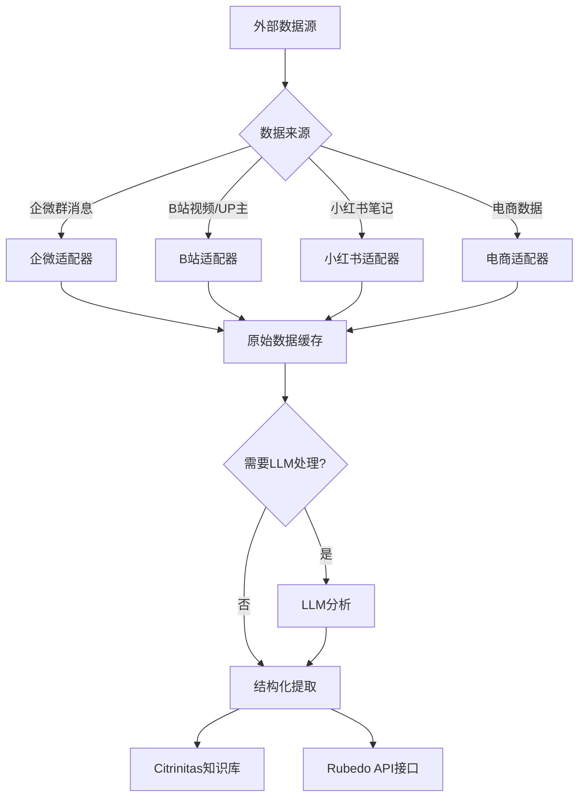

# Nigredo · 馏析 — 流程框图

> v1.0 · 2026-06-26

---

## 主干流程

---

## 节点定义

| 节点ID | 名称 | 输入 | 输出 | 逻辑 | 当前状态 |
|--------|------|------|------|------|:--:|
| C1 | 企微适配器 | 企业微信群消息流 | 消息文本/时间/发送者 | [当前重心] 从零调研方案 | 🔄 |
| C2 | B站适配器 | BV号/UP主ID | 视频/音频/字幕/弹幕/评论 | yt-dlp下载 + bilibili-api-py数据采集 | ✅ |
| C3 | 小红书适配器 | 博主ID/关键词 | 笔记正文/图片/评论 | 待调研 | ⬜ |
| C4 | 电商适配器 | 商品链接/关键词 | 价格/销量/评价 | 远期 | ⬜ |
| D | 原始数据缓存 | 各适配器输出 | 统一格式的原始数据 | 本地缓存，去重 | ✅ |
| E | LLM路由 | 原始数据 | 判定结果 | 手脚+大脑分离：代码能处理的不调LLM | ✅ |
| F | 结构化提取 | 原始数据 | 结构化JSON | 字段映射、格式统一 | ✅ |
| G | LLM分析 | 原始数据 | 结构化结果 | Prompt驱动，按场景分模板 | ✅ |
| H | Citrinitas注入 | 结构化数据 | Qdrant文档 | HTTP API写入athanor_v1集合 | ✅ |
| I | Rubedo API | 结构化数据 | HTTP响应 | REST API，供凝华调用采集结果 | ⬜ |

---

## 节点间连接

| 起→止 | 传递内容 | 触发条件 |
|-------|---------|---------|
| A→B | 外部数据源（URL/消息/ID） | 用户输入或定时任务 |
| B→C1~C4 | 路由到对应适配器 | 自动识别数据来源类型 |
| C1~C4→D | 原始数据 | 适配器采集完成 |
| D→E | 原始数据 | 有新数据待处理 |
| E→F | 原始数据 | 不需要LLM（代码直接处理） |
| E→G | 原始数据 | 需要LLM（语义理解/内容分析） |
| G→F | LLM结果 | LLM分析完成 |
| F→H | 结构化数据 | 数据整理完成 |
| F→I | 结构化数据 | Rubedo请求采集数据 |

---

## 当前重心标注

- 🔴 **C1 企微适配器** — v0.1.0 唯一焦点
- 🔴 **E LLM路由** — 采集→处理的分界线，直接影响成本
- 其余节点：已有基础（C2/D/F/G/H）或远期（C3/C4/I）
