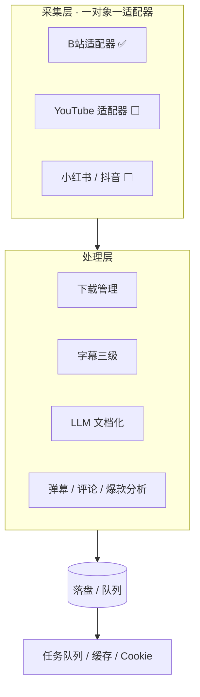

# 🜂 Nigredo · 馏析 — 外部数据采集引擎

> 五器工坊之「采集」环节 —— 把外部世界的视频、弹幕、评论、爆款，自动变成干净的字幕与结构化笔记，喂给炼真提纯、熔知入库。

**Nigredo（馏析）= 外部数据采集引擎。** 分两层：第一层**数据采集**，第二层**采集数据处理**。采集先做。

```
外部世界 → Nigredo(采集) → Albedo(炼真) → Citrinitas(存储) → Rubedo(变现)
              ↑                                          │
              └────────── Rubedo 调用 API ──────────────┘
```

---

## 🤔 为什么需要馏析？

| 你现在的做法 | 用馏析 |
|---|---|
| 刷 B站看到干货，手动记笔记 / 存链接 | 贴链接 → 自动出字幕 + 结构化笔记 |
| 想抄爆款，靠肉眼反复看 | 爆款横向对比 + 脚本拆解，一键出 |
| 弹幕 / 评论里的真知靠碰运气 | 弹幕分析 + 评论分析自动提炼 |
| 字幕缺失的视频干瞪眼 | ASR 引擎可切换（whisper / FunASR-Nano GPU 平级可选） |
| 采集到的东西零散、难复用 | 落盘标准化 + 直连炼真 / 熔知飞轮 |

---

## ✨ 项目亮点

1. **字幕引擎可切换**：优先平台 CC/AI 字幕；缺时由 ASR 引擎转写，whisper 与 FunASR-Nano（GPU，中文更准+专名纠错）平级可选。
2. **平台深度定制**：不只下载视频，还抓弹幕 / 评论 / 数据分析（竞品只做通用处理）。
3. **独家提炼**：脚本模仿（拆解 + 话术模板）+ 爆款横向对比，竞品没有。
4. **任务队列**：`run.bat` 开机自动处理队列，无需手动粘贴。
5. **全本地 / 自托管**：不依赖商业 API，数据不出本机。
6. **五器飞轮**：产出直连炼真提纯、熔知入库，形成数据闭环。

---

## ⚔️ 核心能力 & 竞品对比

> 对标列取自项目自身竞品分析（`docs/competitor-analysis.md`）。✅ 有 ｜ ~ 部分 ｜ 🔮 规划中 ｜ — 无。

| 对比维度 | 馏析 Nigredo | AI-Video-Transcriber | BiliSum | yt-dlp |
|---|:--:|:--:|:--:|:--:|
| B站下载 + 字幕 | ✅ | ✅ | ✅ | ✅(下载) |
| 多平台覆盖（YT / 抖音 / 小红书） | ~ | ✅(30+) | ~ | ✅(1700+) |
| 字幕策略（CC→AI→ASR，引擎可切换） | ✅ | ✅ | ✅ | ~ |
| GPU 中文 ASR（FunASR-Nano，字符级时间戳） | ✅ | — | — | — |
| ASR 专名纠错（半自动词表，保时间轴） | ✅ | — | — | — |
| 弹幕分析（完整） | ✅ | — | ~ | — |
| 评论分析 | ✅ | — | — | — |
| 脚本模仿（拆解 + 话术模板） | ✅ | — | — | — |
| 爆款横向对比 | ✅ | — | — | — |
| AI 文档化 / 学习笔记 | ✅ | ✅(摘要) | ✅(笔记+导图) | — |
| 知识库联动（注入熔知，不直写） | ✅ | — | ✅(RAG) | — |
| 任务队列（开机自动处理） | ✅ | — | — | — |
| 企微群消息采集（免费方案储备） | 🔮 | — | — | — |
| 数据全本地 / 自托管 | ✅ | —(用 OpenAI) | ✅ | ✅ |
| **核心定位 / 各有千秋** | 五器「采集引擎」：平台深度定制(弹幕/评论/脚本/爆款) + 队列免手动 + 全本地 + 直连熔知飞轮 | 全平台转录摘要轻量工具 | 中文优化图文笔记 + 知识库 | 下载引擎底座（被 Nigredo 集成） |

---

## 🔄 操作流程

```mermaid
flowchart LR
    A[粘贴链接 / 入队] --> B[下载音频或视频]
    B --> C{有 CC 字幕?}
    C -->|是| E[提取 CC 字幕]
    C -->|否| D[B站 AI 字幕 WBI 直取]
    D -->|仍无| F[ASR 引擎转写(whisper/FunASR-Nano 可切换)]
    E --> G[字幕文本]
    F --> G
    G --> H{要文档化?}
    H -->|学习笔记| I[LLM 文档化]
    H -->|爆款/脚本| J[分析模块]
    H -->|否| K[落盘 .txt / .srt]
    I --> K
    J --> K
    K --> L[炼真提纯 / 熔知入库]
```

---

## 🏗️ 架构概览



| 层 | 职责 | 关键模块 |
|---|---|---|
| 采集层 | 抓取各平台原始数据，一对象一适配器 | `platforms/bilibili.py`、`platforms/__init__.py`（BasePlatform） |
| 处理层 | 下载 / 字幕 / 文档化 / 分析 | `core/downloader.py`、`core/subtitle.py`、`core/documenter.py`、`core/danmaku.py`、`core/comment.py`、`core/viral.py` |
| 调度层 | 队列 / 缓存 / Cookie 解析 | `core/queue.py`、`utils/cache.py`、`utils/queue.py` |

---

## 📁 目录结构

```
nigredo/
├── app.py                  # Streamlit 入口
├── run.bat                 # 双击启动（任务队列模式，自动处理入队链接）
├── run_queue.py            # 队列 drain 脚本
├── pages/                  # UI 页面（摄入 / 文档输出 / 数据分析 / 引擎配置 / 关于）
├── core/                   # 核心逻辑（下载 / 字幕 / 文档化 / 弹幕 / 评论 / 爆款 / 队列）
├── platforms/              # 平台适配器（一平台一文件，BasePlatform 抽象）
├── prompts/                # LLM Prompt 模板（学习笔记 / 脚本模仿 / 爆款分析）
├── config/                 # 配置（Whisper / B站 Cookie / LLM）
├── utils/                  # 缓存 / 队列 / Cookie 辅助
├── data/                   # 下载产物 / 队列 / 模型（已 gitignore）
├── docs/                   # 竞品分析 / 调研 / 架构评审
├── BLUEPRINT.md            # 项目宪法
├── PROJECT_PLAN.md         # 版本路线图
├── FLOWCHART.md            # 流程框图
└── CHANGELOG.md            # 变更记录
```

---

## 🛠️ 技术栈

| 技术 | 用途 | 授权 |
|---|---|---|
| Python 3.11+ | 运行环境 | PSF |
| Streamlit | Web UI | Apache-2.0 |
| yt-dlp | 视频下载引擎（1700+ 站） | Unlicense |
| faster-whisper | 语音转文字（中文 large-v3 + CUDA 加速） | MIT |
| bilibili-api-python | B站信息 / AI 字幕（WBI 签名） | MIT |
| DeepSeek | LLM 文档化（KB_LLM_* 配置） | 商业 API |

核心依赖均为宽松 / 自有协议，适合未来产品化。

---

## 🗺️ 路线图

| 版本 | 状态 | 内容 |
|------|:--:|------|
| v0.1.0 | ✅ | 企微群消息采集方案调研（结论：短期免费方案可行但暂缓） |
| v0.1.1 | ✅ | B站视频摄入——字幕三级兜底跑通 + 任务队列 + B站配置界面 |
| v0.2.0 | 🔮 | 文件管理（按 UP主 + 日期归档）+ UI 改进 |
| v0.3.0 | 🔮 | 学习笔记生成（LLM 文档化增强）+ 知识库注入（熔知 ingest 接口） |
| v1.0.0 | 🔮 | 多平台适配器（YouTube / 小红书 / 抖音）+ 可产品化封装 |

---

## ⚡ 快速开始

```bash
cd D:\nigredo
pip install -r requirements.txt
cp .env.example .env          # 填 BILIBILI_COOKIE / KB_LLM_API_KEY
streamlit run app.py          # 打开 http://127.0.0.1:8502
```

**任务队列模式**（开机自动处理）：双击 `run.bat` —— 先 drain `data/queue.json` 里的链接，再起 UI，无需手动粘贴。

---

## 👤 适合谁用

| 适合 | 不适合 |
|---|---|
| 一人公司主理人 | 想要端到端自动发内容（那是 Rubedo） |
| 从 B站 / 视频学干货的人 | 想要知识检索（那是 Citrinitas） |
| 要建个人知识库的人 | 只想要单个视频下载（直接用 yt-dlp 更轻） |
| 想产品化采集工具的人 | — |

---

## ❓ FAQ

**Q1：馏析和影刀 RPA / 爬虫有什么不同？**
馏析专注「视频 → 知识」的深度提炼（弹幕 / 评论 / 脚本 / 爆款），且全本地、可产品化；影刀是通用 RPA、yt-dlp 只是下载底座（已被馏析集成），都不做认知层提炼。

**Q2：企微群消息采集做了吗？**
短期未做。已调研完（结论：UIA 自动化 / wechat-decrypt 等免费方案可行但暂缓），当前重心在 B站字幕流程；企微是未来调研目标。

**Q3：字幕引擎是怎么选的？**
优先用平台 CC 人工字幕 / B站 AI 字幕（WBI 直取，免 GPU）；都没有时由 ASR 引擎转写。whisper 与 FunASR-Nano 平级可选（默认 Nano，GPU 中文更准、带字符级时间戳与专名纠错），由 `ASR_BACKEND` 配置切换，不互相兜底。

**Q4：结果怎么进炼真 / 熔知？**
落盘 `.txt`（字幕）/ `.srt`（带时间轴）+ 精炼对象 JSON；炼真读文本做提纯，熔知经其 ingest 接口注入（不直写库）。

**Q5：为什么叫 Nigredo / 馏析？**
炼金四阶段之「黑化」（腐化提纯），英文功能名 Nigredo；馏析 = 分馏提纯，呼应「采集 → 精炼」。五器统一两段式命名。

---

## 🤝 贡献 & 许可证 & 致谢

- **贡献**：Issue / PR 欢迎。
- **许可证**：MIT © [shiyao222333-afk](https://github.com/shiyao222333-afk)
- **致谢**：[yt-dlp](https://github.com/yt-dlp/yt-dlp) · [faster-whisper](https://github.com/SYSTRAN/faster-whisper) · [bilibili-api](https://github.com/Passkou/bilibili-api) · DeepSeek；竞品思路参考 [AI-Video-Transcriber](https://github.com/wendy7756/AI-Video-Transcriber) · [BiliSum](https://github.com/lycohana/BiliSum)。

### OpusMagnum 生态

| 项目 | 职能 |
|------|------|
| [OpusMagnum](https://github.com/shiyao222333-afk/opus-magnum) | 总蓝图 |
| [Citrinitas](https://github.com/shiyao222333-afk/citrinitas) | 知识引擎 —— 馏析数据最终注入此处 |
| [Albedo](https://github.com/shiyao222333-afk/albedo) | 炼真 —— 馏析文本在此提纯 |
| [Rubedo](https://github.com/shiyao222333-afk/rubedo) | 凝华 —— 通过 API 调用馏析 |
