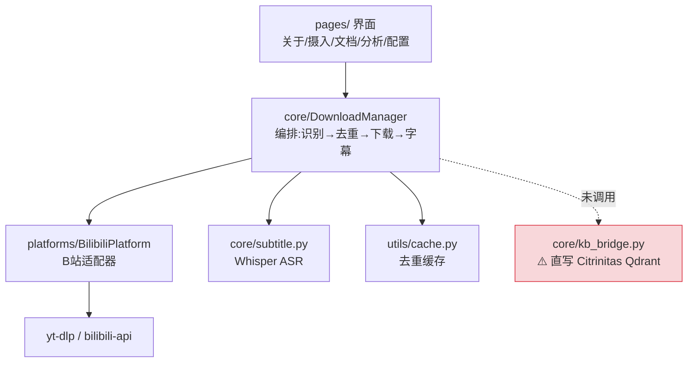

# Nigredo · 馏析 — 内部架构评审

> 评审日期：2026-07-08 ｜ 评审人：软件架构师（架构通）
> 背景：用户要求检查馏析项目自身架构是否合理
> 当前版本：v0.1.1（B站视频摄入——字幕生成跑通）

---

## 一句话结论

**馏析的内部架构是好的、可演进的，不用大改。** 分层清晰、适配器模式落地到位、"一对象一适配器"原则在代码里真实现了。

但有一个**和你刚说的"五个项目都到可用才整合"直接冲突**的隐患：代码里已经预埋了一个"提前且漏水"的 Citrinitas 知识库桥接，现在虽是死代码，但哪天误接上就会把知识库搞脏。这个要摘掉。其余是低成本清理。

---

## 现在的结构

---

## 哪里合理（保留，这是好架构）

| # | 优点 | 证据 |
|---|------|------|
| 1 | **分层干净** | `platforms/`(适配器) `core/`(处理) `pages/`(界面) `utils/`(缓存/队列) `prompts/`(AI提示词) 职责不串 |
| 2 | **适配器模式真落地** | `BilibiliPlatform` 单类内聚：parse_url / get_video_info / download_audio / extract_subtitle / get_danmaku / get_comments；有 bilibili-api→yt-dlp 兜底；Cookie 自动读浏览器。完美对应"一对象一适配器" |
| 3 | **编排清晰** | `DownloadManager.process`：detect_platform → parse → 去重 → 信息 → 下载 → 字幕(CC→Whisper)。`PLATFORMS` 列表是加新平台的天然插槽 |
| 4 | **入口极薄** | `app.py` 只做页面导航，零业务逻辑——好 |
| 5 | **去重已就位** | `VideoCache` 缓存+标记已处理，避免重复下载 |

---

## 哪里有坑（按严重程度）

### 🔴 RISK 1 — 提前且"漏水"的 Citrinitas 整合（与你"整合等规模"的指令冲突）

| 项 | 现状 |
|----|------|
| 桥接代码 | `core/kb_bridge.py` 的 `inject_to_athanor()` **直接往 Citrinitas 的 Qdrant 写数据**（`{QDRANT_URL}/collections/.../points`），绕过了 Citrinitas 自己的接口和加工流程 |
| 配置耦合 | `config/__init__.py` 里塞了 `QDRANT_URL` / `QDRANT_COLLECTION_VIDEO` / `QDRANT_COLLECTION_ANALYSIS` —— 这是 Citrinitas 的存储配置，不该出现在 Nigredo 里 |
| 静默污染 | 如果 Ollama 没跑，它用 **hash 兜底向量** 注入——显示"成功"，但文档在知识库里**根本搜不到**（数据变垃圾却不报错） |
| 目前是否真接上 | **没接**。代码里没有任何地方调用 `inject_to_athanor`（只在 `docs/citrinitas-hook-interface.md` 里设计了怎么接）。所以目前是死代码，还没真污染 |

**建议**：既然你明确"五个项目都到可用才整合"，现在就**冻结并移除**这个桥接——
- 删 `core/kb_bridge.py`
- 删 `docs/citrinitas-hook-interface.md`（那份设计正是"直写数据库"的错误路线）
- 删 `config/__init__.py` 里的 `QDRANT_*` 三项

等真要整合时，再按"**调用 Citrinitas 的 ingest 接口**"（不是直写它的数据库）来做。这样彻底消除误接风险。

### 🟡 RISK 2 — 适配器没有统一接口/基类

`platforms/` 里目前只有 `bilibili.py`，方法是鸭子类型（靠约定，不靠强制）。等加第 2 个适配器（小红书/企微）时，没有契约约束，容易方法签名飘掉、调用方崩溃。

**建议（低成本、可逆）**：现在就在 `platforms/__init__.py` 里定义一个 `BasePlatform` 抽象类或 `Protocol`，规定 `parse_url / get_video_info / download_audio / extract_subtitle` 等必须实现。第一个适配器已在用，加基类几乎零成本，给未来第 2 个上保险。

### 🟡 RISK 3 — 命名漂移（旧代号 Alembic 残留）

| 位置 | 旧名 | 应是 |
|------|------|------|
| `config/__init__.py` | `ALEMBIC_LLM_*` / `ALEMBIC_DEBUG` | `NIGREDO_*` |
| `app.py` CSS | `.alembic-card` | `.nigredo-card` |
| `kb_bridge.py` | `source: "alembic"` / `pipeline: "video-forge"` | 应删（见 RISK 1） |
| `FLOWCHART.md` | "🔴 企微适配器 当前焦点" | 应为 B站字幕流程（蓝图/计划 10 天前已切换，流程图没同步） |

**影响**：以后对接/维护时混淆"这到底叫啥、当前在做啥"。建议统一到炼金名（Nigredo），并补更 FLOWCHART 的当前重心。

### 🟢 已记录的技术债（可接受，先跟踪）

- 无单元测试（PROJECT_PLAN 已记）
- 缓存清理策略缺失（`index.json` 会越涨越大）
- `parse_url` 的 `b23.tv` 短链解析还是 TODO

---

## 推荐动作（按优先级）

| 优先级 | 动作 | 原因 |
|:--:|------|------|
| 🔴 | 移除 `kb_bridge.py` + `citrinitas-hook-interface.md` + config 里 `QDRANT_*` | 消除与你"整合等规模"冲突的提前耦合 + 静默污染风险 |
| 🟡 | `platforms/__init__.py` 加 `BasePlatform` 接口 | 给第 2 个适配器上保险，现在做成本最低 |
| 🟡 | 统一命名（Alembic→Nigredo）+ 更新 FLOWCHART 当前重心 | 消除混淆 |
| 🟢 | 跟踪技术债（测试/缓存清理） | v0.1.1 阶段可接受 |

---

## 总结

馏析的内部架构**不需要重构**，方向是对的。真正要做的只有一件事有分量：**把那个提前的 Citrinitas 桥接摘掉**，其余都是低成本清理。这正好贯彻你"整合等规模"的原则——现在各自长好自己的本事，别提前把线接上。

*本文档随架构演进更新。下次触发点：加第 2 个平台适配器，或真要启动跨项目整合时。*
